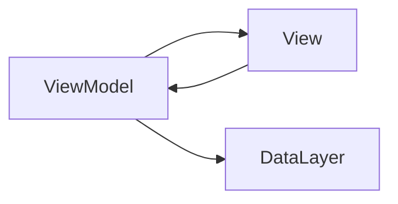
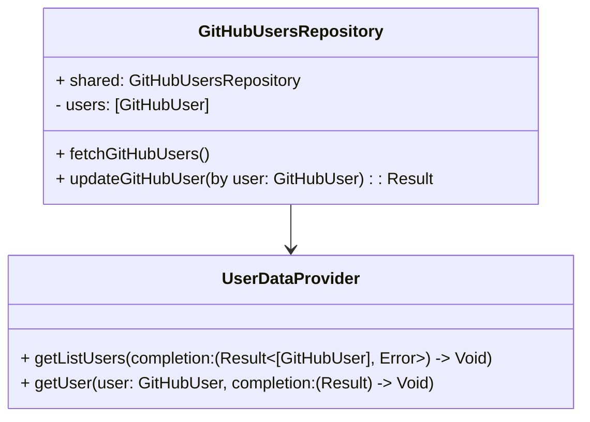
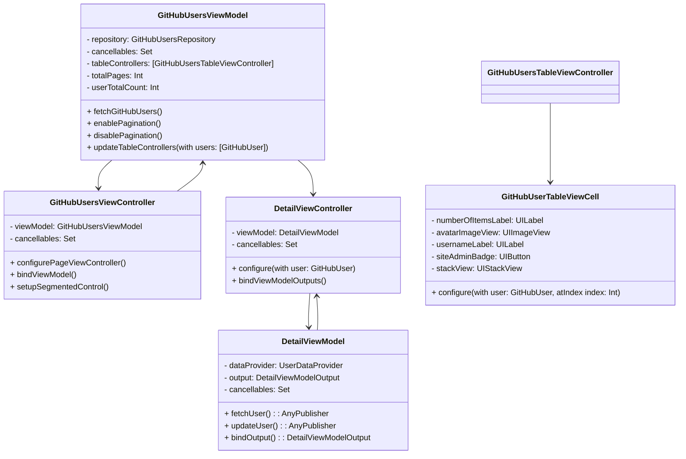
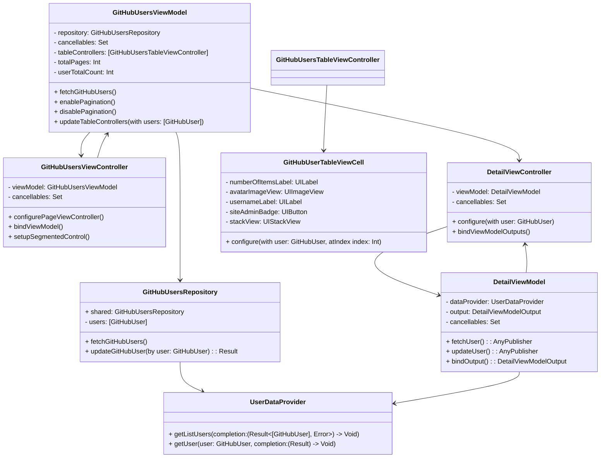

## README

**Dear Interviewer,**

Thank you for taking the time to review my submission for the GitHub Users Application task. Below, I'll guide you through the key aspects of my implementation.

### Function

### Architecture

I've implemented the application using the MVVM (Model-View-ViewModel) architecture pattern. This architectural choice allows for separation of concerns, making the codebase modular and easier to maintain.

### Technologies Used

- **Swift:** As the primary programming language for iOS app development.
- **Alamofire:** Used for networking tasks like fetching data from the GitHub API endpoints.
- **Combine:** Utilized for reactive programming, enabling seamless data flow between components.
- **UIKit:** The foundational framework for building the user interface of iOS applications.

### How to Review the Code

By following this step-by-step approach and examining the dependencies between different components as depicted in the diagrams, you'll gain a comprehensive understanding of the codebase and its implementation details.

## Data Layer

The class diagram above illustrates the structure of the Data Layer in the application. There are two main classes:

1. **GitHubUsersRepository:** This class manages GitHub user data within the application. It contains a shared instance and an array of GitHub users. It provides methods to fetch GitHub users from a remote source and update user information. 

2. **UserDataProvider:** This class is responsible for communicating with the GitHub API to retrieve user data. It offers methods to fetch a list of GitHub users and detailed information about a specific user.

The GitHubUsersRepository class depends on the UserDataProvider class to fetch data. It calls methods of the UserDataProvider class to retrieve the necessary user data.

These classes collectively handle data operations in the application, ensuring effective interaction with remote services and providing the required data to other parts of the application.

## Present Layer
1. **Move to GitHubUsersViewModel.swift:**
   - Here, you'll find the `GitHubUsersViewModel`, which orchestrates the business logic and data flow for presenting GitHub users in a list. It interacts with the repository to fetch data and prepares it for presentation.

2. **Explore GitHubUsersViewController.swift:**
   - In this file, the `GitHubUsersViewController` is responsible for presenting the list of GitHub users in the user interface. It binds to the view model and updates the UI accordingly.

3. **Dive into DetailViewController.swift:**
   - Detailed information about a selected GitHub user is presented in the `DetailViewController`. It allows for editing and saving user details. It interacts with the view model to fetch and update user data.

4. **Inspect GitHubUserTableViewCell.swift:**
   - The `GitHubUserTableViewCell` is a custom table view cell designed to display GitHub user information. It is utilized by the `GitHubUsersTableViewController` to populate the list of users.

## Dependency Relationships

The dependency relationships among these classes are as follows:

- GitHubUsersRepository relies on UserDataProvider to fetch user data.
- GitHubUsersViewModel depends on GitHubUsersRepository to manage user data.
- GitHubUsersViewModel depends on GitHubUsersViewController to provide data and update the user interface.
- GitHubUsersViewController depends on GitHubUsersViewModel to fetch and process user data.
- GitHubUsersViewModel depends on DetailViewController to display detailed user information.
- DetailViewModel depends on UserDataProvider to fetch user details.
- DetailViewController depends on DetailViewModel to fetch and display user details.
- GitHubUsersTableViewController depends on GitHubUserTableViewCell to display basic user information.

Feel free to explore the codebase, and I'm happy to provide further explanations or clarifications as needed.

Thank you for considering my application, and I look forward to discussing my implementation with you in more detail.

